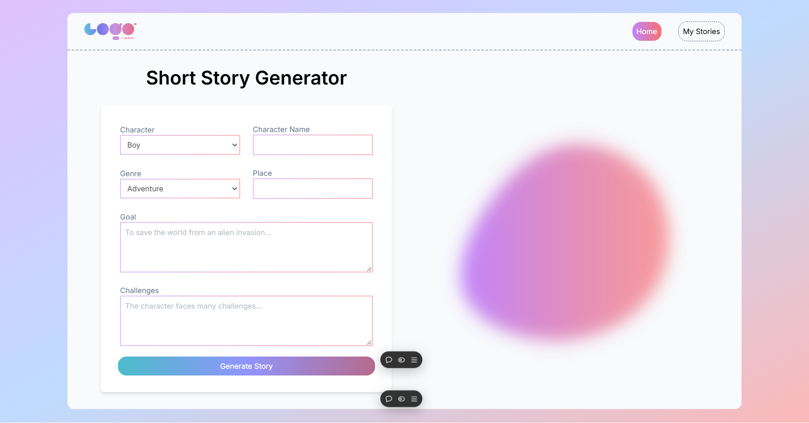
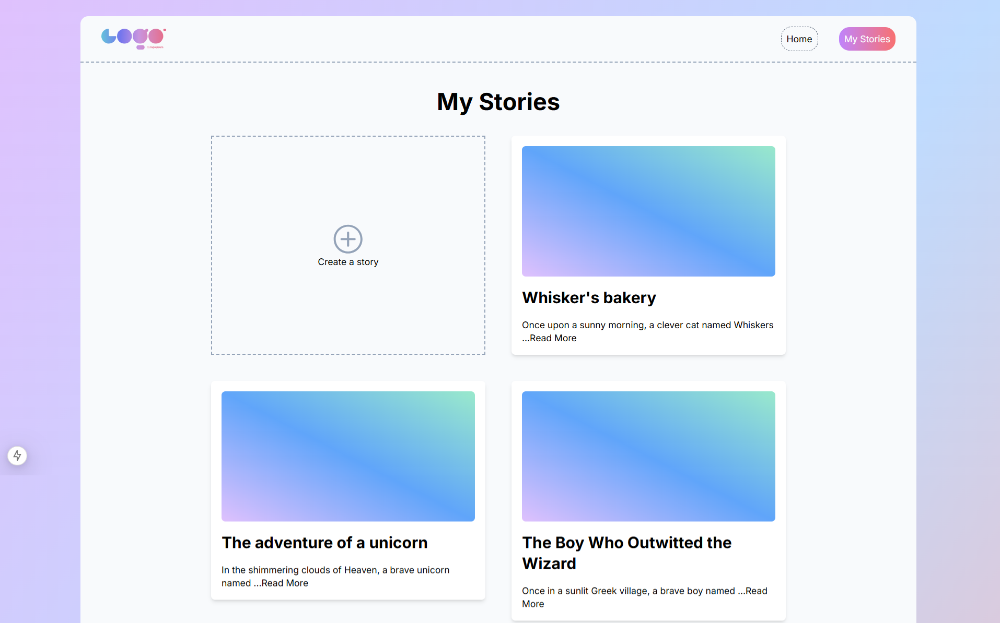
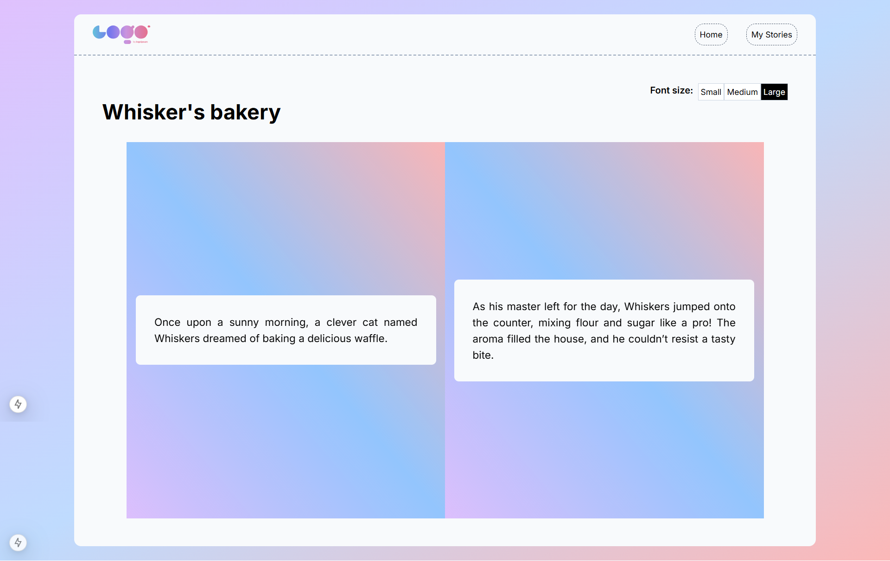

# Story AI App

This is a [Next.js](https://nextjs.org) project bootstrapped with [`create-next-app`](https://nextjs.org/docs/app/api-reference/cli/create-next-app).
The Story AI App generates children's short stories based on user input using the OpenAI API. In this application, considering the budget, `gpt-4o-mini` is used to generate stories. The demo application can be tested on this [URL](https://story-ai-green.vercel.app/). Due to the budget on my api billing, please don't misuse it.

## Getting Started

### Prerequisites

Make sure the followings installed on your machine:

- Node.js (v14 or later)
- npm (v6 or later) or yarn(v1.22 or later)
- Prisma CLI (v4 or later)

### Installation

1. Clone the repository:

```bash
git clone https://github.com/MKhantKyaw/story-ai.git
cd story-ai
```

2. Install the dependencies

```bash
npm install
#or
yarn install
```

#### Environment Variables

Create a `.env` file in the root directory and add the following environment variables:

```javascript
NEXT_PUBLIC_API_BASE_URL=http://localhost::3000
OPENAI_API_KEY=your-openai-api-key
DATABASE_URL=your-database-url
```

Replace `your-openai-api-key` with your actual OpenAI API key and `your-database-url` with your actual database URL.

#### Prisma Setup

1. Initialize Prisma:

```bash
npx prisma init
```

2. Update the provider in the prisma/schema.prisma file to match your database provider. For example, to use MongoDB, update the provider field as follows:

```javascript
datasource db {
  provider = "mongodb"
  url      = env("DATABASE_URL")
}
```

3. Generate Prisma Client and push the schema to your database:

```bash
npx prisma generate
npx prisma db push
```

### Running the Development Server

First, run the development server:

```bash
npm run dev
# or
yarn dev
# or
pnpm dev
# or
bun dev
```

Open [http://localhost:3000](http://localhost:3000) with your browser to see the result.

### Screenshots

1. Home Page
   

2. Stories Page
   

3. Reading Story Page
   

## Learn More

To learn more about Next.js, take a look at the following resources:

- [Next.js Documentation](https://nextjs.org/docs) - learn about Next.js features and API.
- [Learn Next.js](https://nextjs.org/learn) - an interactive Next.js tutorial.

You can check out [the Next.js GitHub repository](https://github.com/vercel/next.js) - your feedback and contributions are welcome!
